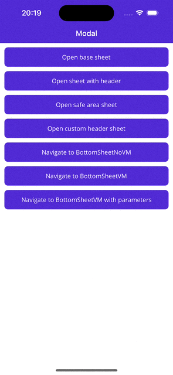

# Plugin.Maui.BottomSheet
Show native BottomSheets with .NET MAUI!

This library comes with a built-in NavigationService to make navigation between BottomSheets und Pages easy!

    

# Samples

<strong>Check out the sample project to explore all features!</strong>.

## Prerequisites

`iOS` at least iOS 15

`Android` at least API 21

# Setup

Enable this plugin by calling `UseBottomSheet()` in your `MauiProgram.cs`

```cs
var builder = MauiApp.CreateBuilder();
builder
  .UseMauiApp<App>()
  .UseMauiBottomSheet()
  .ConfigureFonts(fonts =>
  {
    fonts.AddFont("OpenSans-Regular.ttf", "OpenSansRegular");
    fonts.AddFont("OpenSans-Semibold.ttf", "OpenSansSemibold");
  })
  .RegisterPages()
  .RegisterViewModels()
  .PlatformServices();

#if DEBUG
builder.Logging.AddDebug();
#endif

return builder.Build();
```

# Bottom Sheet Control

## Properties
All properties expect `ContentTemplate`, `TitleViewTemplate` and `Peek.PeekViewDataTemplate` are `BindableProperties`

`IsOpen` Open or close the BottomSheet

`ContentTemplate` Content of the BottomSheet.

`Peek` Peek settings
| Setting    | Decription |
| -------- | ------- |
| IgnoreSafeArea  | Bottom safe area will either be ignored or not |
| PeekHeight | Static value for the peek height    |
| PeekViewDataTemplate    | If set the view will be placed above the `ContentTemplate` and it's height will be set as peek height  |

### Appearance

`IsDraggable` Disable/Enable dragging(especially usefull if drawing gestures are made inside the bottom sheet)

`HasHandle` Display a drag handle at the top of the BottomSheet

#### Header
`ShowHeader` Display a header at the top of the BottomSheet

`TopLeftButtonText` Text of top left button

`TopRightButtonText` Text of top right button

`TitleText` BottomSheet title

`TitleViewTemplate` Custom title view.

`HeaderAppearance` Define the look of the header
| BottomSheetHeaderAppearanceMode    | Decription |
| -------- | ------- |
| None  | Do not show a button |
| LeftAndRightButton | Show a button at the top lef and at the top right     |
| LeftButton    | Show a button at the top left    |
| RightButton    | Show a button at the top right    |

#### States
`SheetStates` Allowed states of the BottomSheet
| BottomSheetState    | Decription |
| -------- | ------- |
| Unknown  | BottomSheet can be all available states |
| Peek | Only `BottomSheet.Peek` is visible. Expanding not allowed     |
| Medium    | BottomSheet height will be half of the sceen. Expanding/collapsing not allowed    |
| Large    | BottomSheet will be display in full screen. Expanding/collapsing not allowed    |
| All    | BottomSheet can be all available states    |

`SelectedSheetState` Change the current Sheet state. Sheet will be expanded/collapsed if the selected state is allowed.

### Interaction

#### Commands
`TopRightButtonCommand` `TopRightButtonCommandParameter`

`TopLeftButtonCommand` `TopLeftButtonCommandParameter`

`ClosingCommand` `ClosingCommandParameter`

`ClosedCommand` `ClosedCommandParameter`

`OpeningCommand` `OpeningCommandParameter`

`OpenedCommand` `OpenedCommandParameter`

#### Events
`Closing`
`Closed`
`Opening`
`Opened`

# XAML usage

In order to make use of the sheet within XAML you can use this namespace:

'xmlns:bottomsheet="clr-namespace:Maui.BottomSheet;assembly=Maui.BottomSheet"'

The `BottomSheet` is a `View` and can be added in any layout or control which accepts `View`.
To open/close a BottomSheet simply set the `IsOpen` property to true/false. You can have <strong>multiple</strong> BottomSheets on one page.
```
<bottomsheet:BottomSheet IsOpen="True">
    <bottomsheet:BottomSheet.ContentTemplate>
        <DataTemplate>
            <VerticalStackLayout>
                <Label Text="I'm a simple BottomSheet!/>
            </VerticalStackLayout>
        </DataTemplate>
    </bottomsheet:BottomSheet.ContentTemplate>
</bottomsheet:BottomSheet>
```

# Navigation

The `IBottomSheetNavigationService` is be registered automatically and can be resolved by `DI`. 

```
private readonly IBottomSheetNavigationService _bottomSheetNavigationService;

public MainViewModel(IBottomSheetNavigationService bottomSheetNavigationService)
{
  _bottomSheetNavigationService = bottomSheetNavigationService;
}
```

To navigate to a `BottomSheet` you have to [register](https://learn.microsoft.com/en-us/dotnet/architecture/maui/dependency-injection) the `BottomSheets` and `ViewModels`
```
builder.Services.AddTransient<BottomSheetVMViewModel>();
builder.Services.AddTransient<BottomSheetGoBackViewModel>();

builder.Services.AddTransient<IBottomSheet, BottomSheetNoVM>();
builder.Services.AddTransient<IBottomSheet, BottomSheetVM>();
builder.Services.AddTransient<IBottomSheet, BottomSheetGoBack>();
```
Navigate to a `BottomSheet` and wire it automatically to the specified `ViewModel` or navigate to a `BottomSheet` without a `ViewModel`

```
_bottomSheetNavigationService.NavigateTo<BottomSheetNoVM>();
_bottomSheetNavigationService.NavigateTo<BottomSheetVM, BottomSheetVMViewModel>();
```
To close a `BottomSheet` simply call `GoBack` or `ClearBottomSheetStack`(if you have multiple sheets open and want to close all of them)

You can pass parameters on each navigation(this follows the principle of shell navigation)
Pass an instance of the `BottomSheetNavigationParameters` to the navigation and if the target `ViewModel` implements `IQueryAttributable` the parameters will be applied.


