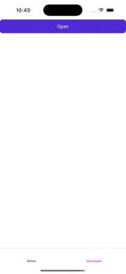
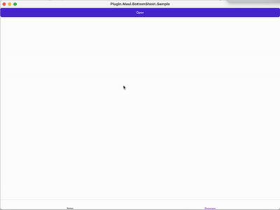
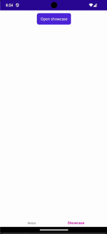
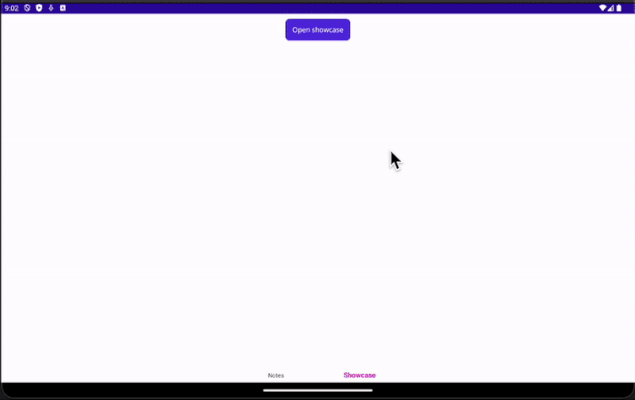

# 📱 Plugin.Maui.BottomSheet

**🚀 Show native BottomSheets with .NET MAUI!**

[](https://www.nuget.org/packages/Plugin.Maui.BottomSheet)
[](LICENSE)
[](#platforms)

## ✨ Features

- 🧭 **Built-in NavigationService** - Seamless navigation between bottom sheets
- 📄 **Flexible Content** - Open any ContentPage or View as BottomSheet
- 🎨 **Customizable Layout** - Create BottomSheets in any layout
- 📋 **Configurable Header** - Full header customization support
- 🏗️ **MVVM Support** - Complete MVVM pattern integration
- 🎯 **Native Performance** - Platform-specific implementations for optimal UX

## 🎯 Quick Demo

Check out the sample project to see the API in action!

## 🌍 Platform Support

<table>
<tr>
<td>

### 📱 iOS
**Minimum:** iOS 15+



<td>

### 💻 MacCatalyst



</td>
<td>

### 🤖 Android
**Minimum:** API 23+




</td>
</tr>
</table>

## 🚀 Quick Start

### 1️⃣ Installation

Install the NuGet package:

```bash
dotnet add package Plugin.Maui.BottomSheet
```

### 2️⃣ Setup

Enable the plugin in your `MauiProgram.cs`:

```csharp
using Plugin.Maui.BottomSheet.Hosting;

var builder = MauiApp.CreateBuilder();
builder
    .UseMauiApp<App>()
    .UseBottomSheet() // 👈 Add this line
    .ConfigureFonts(fonts =>
    {
        fonts.AddFont("OpenSans-Regular.ttf", "OpenSansRegular");
        fonts.AddFont("OpenSans-Semibold.ttf", "OpenSansSemibold");
    });

#if DEBUG
builder.Logging.AddDebug();
#endif

return builder.Build();
```

### 3️⃣ Basic Usage

Add the XAML namespace:
```
xmlns:bottomsheet="http://pluginmauibottomsheet.com"
```

Create a simple bottom sheet:
```xaml
<bottomsheet:BottomSheet x:Name="MyBottomSheet" IsOpen="{Binding IsSheetOpen}">
    <bottomsheet:BottomSheet.Content>
        <bottomsheet:BottomSheetContent>
            <Label Text="Hello from Bottom Sheet!" />
        </bottomsheet:BottomSheetContent>
    </bottomsheet:BottomSheet.Content>
</bottomsheet:BottomSheet>
```

## 📖 API Reference

### 🔧 Core Properties

| Property                | Type                     | Description                                               |
|-------------------------|--------------------------|-----------------------------------------------------------|
| `IsModal`               | `bool`                   | Enable/disable interaction with content under BottomSheet |
| `IsCancelable`          | `bool`                   | Allow user to close via gestures or background click      |
| `HasHandle`             | `bool`                   | Show/hide the drag handle                                 |
| `ShowHeader`            | `bool`                   | Show/hide the header section                              |
| `IsOpen`                | `bool`                   | Control open/close state                                  |
| `IsDraggable`           | `bool`                   | Enable/disable drag gestures                              |
| `States`                | `List<BottomSheetState>` | Allowed states (Peek, Medium, Large)                      |
| `CurrentState`          | `BottomSheetState`       | Current display state                                     |
| `PeekHeight`            | `double`                 | Height when in peek state (iOS 16+)                       |
| `Padding`               | `double`                 | Internal padding                                          |
| `BackgroundColor`       | `Color`                  | Background color                                          |
| `IgnoreSafeArea`        | `bool`                   | Ignore safe area (iOS only)                               |
| `CornerRadius`          | `float`                  | Top corner radius                                         |
| `WindowBackgroundColor` | `Color`                  | Window background (modal only)                            |

### 🎭 BottomSheet States

| State    | Description                      |
|----------|----------------------------------|
| `Peek`   | Fractional height (customizable) |
| `Medium` | Half screen height               |
| `Large`  | Full screen height               |

### 🎨 Header Configuration

| Property              | Type                                    | Description                                              |
|-----------------------|-----------------------------------------|----------------------------------------------------------|
| `TitleText`           | `string`                                | Title text displayed in header                           |
| `TopLeftButton`       | `Button`                                | Custom button for top-left position                      |
| `TopRightButton`      | `Button`                                | Custom button for top-right position                     |
| `HeaderDataTemplate`  | `DataTemplate`                          | Custom view template (overrides other header properties) |
| `Content`             | `View`                                  | Direct view content                                      |                     |                                         |                                                          |
| `HeaderAppearance`    | `BottomSheetHeaderButtonAppearanceMode` | Controls which buttons are displayed                     |
| `ShowCloseButton`     | `bool`                                  | Show built-in close button                               |
| `CloseButtonPosition` | `CloseButtonPosition`                   | Position of close button (Left/Right)                    |

> [!CAUTION]
> Be careful when using `Content` because the Content will be created even if the BottomSheet isn't open and this may have a negative performance impact.
> `Content` should only be used with navigation and not in `BottomSheets` added directly to a `Layout`.

### 📱 Content Configuration

| Property          | Type           | Description               |
|-------------------|----------------|---------------------------|
| `Content`         | `View`         | Direct view content       |
| `ContentTemplate` | `DataTemplate` | Template for lazy loading |

> [!CAUTION]
> Be careful when using `Content` because the Content will be created even if the BottomSheet isn't open and this may have a negative performance impact.
> `Content` should only be used with navigation and not in `BottomSheets` added directly to a `Layout`.

### 🎨 Styling Options

#### BottomSheet Style Properties

| Property      | Type                     | Description                               |
|---------------|--------------------------|-------------------------------------------|
| `HeaderStyle` | `BottomSheetHeaderStyle` | Styling configuration for header elements |

#### BottomSheet Header Style Properties

| Property                          | Type             | Description                          |
|-----------------------------------|------------------|--------------------------------------|
| `TitleTextColor`                  | `Color`          | Color of the title text              |
| `TitleTextFontSize`               | `double`         | Font size of the title text          |
| `TitleTextFontAttributes`         | `FontAttributes` | Font attributes (Bold, Italic, None) |
| `TitleTextFontFamily`             | `string`         | Font family name for title text      |
| `TitleTextFontAutoScalingEnabled` | `bool`           | Enable automatic font scaling        |
| `CloseButtonHeightRequest`        | `double`         | Requested height for close button    |
| `CloseButtonWidthRequest`         | `double`         | Requested width for close button     |
| `CloseButtonTintColor`            | `Color`          | Tint color for close button icon     |

## 🎪 Advanced Examples

### 📋 Complete XAML Example

```xaml
<bottomsheet:BottomSheet
    x:Name="AdvancedBottomSheet"
    Padding="20"
    CornerRadius="20"
    HasHandle="True"
    IgnoreSafeArea="True"
    IsCancelable="True"
    IsDraggable="True"
    IsModal="True"
    IsOpen="{Binding IsOpen}"
    ShowHeader="True"
    States="Peek,Medium,Large"
    CurrentState="Medium"
    WindowBackgroundColor="Black">
    
    <!-- Header Configuration -->
    <bottomsheet:BottomSheet.Header>
        <bottomsheet:BottomSheetHeader
            CloseButtonPosition="Right"
            HeaderAppearance="LeftAndRightButton"
            ShowCloseButton="True"
            TitleText="My Awesome Sheet">
            <bottomsheet:BottomSheetHeader.TopLeftButton>
                <Button Command="{Binding LeftButtonCommand}" Text="Cancel" />
            </bottomsheet:BottomSheetHeader.TopLeftButton>
            <bottomsheet:BottomSheetHeader.TopRightButton>
                <Button Command="{Binding RightButtonCommand}" Text="Save" />
            </bottomsheet:BottomSheetHeader.TopRightButton>
        </bottomsheet:BottomSheetHeader>
    </bottomsheet:BottomSheet.Header>
    
    <!-- Content with Peek Height Behavior -->
    <bottomsheet:BottomSheet.Content>
        <bottomsheet:BottomSheetContent>
            <bottomsheet:BottomSheetContent.ContentTemplate>
                <DataTemplate>
                    <VerticalStackLayout>
                        <!-- Peek Content -->
                        <ContentView>
                            <ContentView.Behaviors>
                                <bottomsheet:BottomSheetPeekBehavior />
                            </ContentView.Behaviors>
                            <Label Text="This content is visible in peek mode" />
                        </ContentView>
                        
                        <!-- Full Content -->
                        <Grid>
                            <Label Text="This content appears when expanded" />
                            <!-- Your content here -->
                        </Grid>
                    </VerticalStackLayout>
                </DataTemplate>
            </bottomsheet:BottomSheetContent.ContentTemplate>
        </bottomsheet:BottomSheetContent>
    </bottomsheet:BottomSheet.Content>
    
    <!-- Styling -->
    <bottomsheet:BottomSheet.BottomSheetStyle>
        <bottomsheet:BottomSheetStyle>
            <bottomsheet:BottomSheetStyle.HeaderStyle>
                <bottomsheet:BottomSheetHeaderStyle 
                    TitleTextColor="Blue" 
                    TitleTextFontSize="18"
                    TitleTextFontAttributes="Bold"
                    CloseButtonTintColor="Red"/>
            </bottomsheet:BottomSheetStyle.HeaderStyle>
        </bottomsheet:BottomSheetStyle>
    </bottomsheet:BottomSheet.BottomSheetStyle>
</bottomsheet:BottomSheet>
```

### 🎨 Global Styling

```xaml
<Style TargetType="bottomsheet:BottomSheet">
    <Setter Property="BottomSheetStyle">
        <Setter.Value>
            <bottomsheet:BottomSheetStyle>
                <bottomsheet:BottomSheetStyle.HeaderStyle>
                    <bottomsheet:BottomSheetHeaderStyle
                        CloseButtonHeightRequest="40"
                        CloseButtonTintColor="LightBlue"
                        CloseButtonWidthRequest="40"
                        TitleTextColor="Blue"
                        TitleTextFontAttributes="Bold"
                        TitleTextFontAutoScalingEnabled="True"
                        TitleTextFontFamily="OpenSansRegular"
                        TitleTextFontSize="20" />
                </bottomsheet:BottomSheetStyle.HeaderStyle>
            </bottomsheet:BottomSheetStyle>
        </Setter.Value>
    </Setter>
</Style>
```

## 🧭 Navigation System

### 🚀 Setup Navigation

Register your bottom sheets for navigation:

```csharp
// Basic registration
builder.Services.AddBottomSheet<UserProfilePage>("UserProfile");

// With ViewModel binding
builder.Services.AddBottomSheet<UserProfileSheet, UserProfileViewModel>("UserProfile");

// With default configuration
builder.Services.AddBottomSheet<UserProfilePage>("UserProfile", (sheet, page) =>
{
    sheet.States = [BottomSheetState.Medium, BottomSheetState.Large];
    sheet.CurrentState = BottomSheetState.Large;
    sheet.ShowHeader = true;
    sheet.Header = new BottomSheetHeader()
    {
        TitleText = page.Title,
    };
});
```

### 🎯 Using Navigation Service

```csharp
public class MainViewModel
{
    private readonly IBottomSheetNavigationService _navigationService;

    public MainViewModel(IBottomSheetNavigationService navigationService)
    {
        _navigationService = navigationService;
    }

    // Navigate to a bottom sheet
    public async Task ShowUserProfile()
    {
        await _navigationService.NavigateTo("UserProfile");
    }

    // Navigate with parameters
    public async Task ShowUserProfile(int userId)
    {
        var parameters = new BottomSheetNavigationParameters
        {
            { "UserId", userId },
            { "Mode", "Edit" },
            { "ShowActions", true }
        };
        
        await _navigationService.NavigateTo("UserProfile", parameters);
    }

    // Navigate with parameters and custom configuration
    public async Task ShowProductDetails(Product product)
    {
        var parameters = new BottomSheetNavigationParameters
        {
            { "Product", product },
            { "Category", product.CategoryId },
            { "ReadOnly", false }
        };

        await _navigationService.NavigateTo("ProductDetails", parameters, configure: sheet =>
        {
            sheet.Header.TitleText = product.Name;
            sheet.CurrentState = BottomSheetState.Large;
            sheet.HasHandle = true;
        });
    }

    // Navigate with ViewModel and parameters
    public async Task ShowEditForm<T>(T model, string formType)
    {
        var parameters = new BottomSheetNavigationParameters
        {
            { "Model", model },
            { "FormType", formType },
            { "Timestamp", DateTime.Now }
        };

        await _navigationService.NavigateTo<EditFormViewModel>("EditForm", parameters);
    }

    // Navigate with complex object parameters
    public async Task ShowOrderSummary(Order order, List<OrderItem> items, decimal total)
    {
        var parameters = new BottomSheetNavigationParameters
        {
            { "Order", order },
            { "OrderItems", items },
            { "Total", total },
            { "Currency", "USD" },
            { "CanEdit", order.Status == OrderStatus.Draft }
        };

        await _navigationService.NavigateTo("OrderSummary", parameters);
    }

    // Go back with result parameters
    public async Task CloseWithResult()
    {
        var resultParameters = new BottomSheetNavigationParameters
        {
            { "Result", "Success" },
            { "ModifiedData", GetModifiedData() },
            { "HasChanges", true }
        };

        await _navigationService.GoBack(resultParameters);
    }

    // Go back to specific sheet with parameters
    public async Task GoBackToSheet(string targetSheet)
    {
        var parameters = new BottomSheetNavigationParameters
        {
            { "ReturnReason", "UserCancelled" },
            { "Timestamp", DateTime.Now }
        };

        await _navigationService.GoBack(parameters, targetSheet);
    }

    // Clear all sheets with notification parameters
    public async Task CloseAllSheets()
    {
        var parameters = new BottomSheetNavigationParameters
        {
            { "CloseReason", "ForceClose" },
            { "SaveState", true }
        };

        await _navigationService.ClearBottomSheetStack(parameters);
    }
}
```

### 🔄 Navigation Lifecycle

Implement `INavigationAware` for lifecycle events:

```csharp
public class UserProfileViewModel : INavigationAware
{
    public void OnNavigatedTo(IBottomSheetNavigationParameters parameters)
    {
        // Sheet opened
        var userId = parameters.GetValue<string>("UserId");
        LoadUserData(userId);
    }

    public void OnNavigatedFrom(IBottomSheetNavigationParameters parameters)
    {
        // Sheet closed or another sheet opened
        SaveChanges();
    }
}
```

> [!TIP]
> Not only can the BottomSheet’s `ViewModel` implement `INavigationAware`, but so can the `ViewModel` of the parent view that launched the `BottomSheet`. This allows the parent to respond when:
> - The first BottomSheet is opened (OnNavigatedFrom)
> - The last BottomSheet is closed (OnNavigatedTo)
>
> This is especially useful for suspending or restoring state in the parent view while modals are active.

### 🛡️ Navigation Confirmation

Implement confirmation dialogs:

```csharp
public class EditUserViewModel : IConfirmNavigationAsync
{
    public async Task<bool> CanNavigateAsync(IBottomSheetNavigationParameters? parameters)
    {
        if (HasUnsavedChanges)
        {
            return await Shell.Current.CurrentPage.DisplayAlert(
                "Unsaved Changes",
                "You have unsaved changes. Do you want to discard them?",
                "Discard",
                "Cancel");
        }
        return true;
    }
}
```

> [!IMPORTANT]  
> When using the `IsOpen` to manage the visibility of a `BottomSheet`, the parent `ViewModel` can implement `INavigationAware` to respond to the lifecycle of the `BottomSheet`.
> This allows the parent `ViewModel` to handle actions when:
> 
> | Scenario                                       | `INavigationAware` on Parent Triggered? |
> |------------------------------------------------|-----------------------------------------|
> | BottomSheet opened via navigation              | ❌ No                                    |
> | BottomSheet opened without navigation (IsOpen) | ✅ Yes                                   |

## 🎯 Event Handling

### 📱 Commands

```csharp
public class MyViewModel
{
    public ICommand TopLeftButtonCommand { get; }
    public ICommand TopRightButtonCommand { get; }
    public ICommand OpeningCommand { get; }
    public ICommand OpenedCommand { get; }
    public ICommand ClosingCommand { get; }
    public ICommand ClosedCommand { get; }
}
```

### 🎭 Events

```csharp
MyBottomSheet.Opening += OnOpening;
MyBottomSheet.Opened += OnOpened;
MyBottomSheet.Closing += OnClosing;
MyBottomSheet.Closed += OnClosed;
```

## 🔧 Platform-Specific Features

### 🤖 Android

#### 🎨 Custom Themes

```csharp
// Set custom theme before opening
MyBottomSheet.On<Android>().SetTheme(Resource.Style.My_Awesome_BottomSheetDialog);
```

#### 📏 Size Constraints

```csharp
// Code approach
MyBottomSheet.On<Android>().SetMaxHeight(800);
MyBottomSheet.On<Android>().SetMaxWidth(600);
MyBottomSheet.On<Android>().SetMargin(new Thickness(10, 0, 10, 0));
MyBottomSheet.On<Android>().SetHalfExpanedRatio = 0.8f;
```

```xaml
<!-- XAML approach -->
xmlns:androidBottomsheet="http://pluginmauibottomsheet.com/platformconfiguration/android"

<bottomsheet:BottomSheet
    androidBottomsheet:BottomSheet.MaxWidth="300"
    androidBottomsheet:BottomSheet.Margin="10,0,10,0"
    androidBottomsheet:BottomSheet.HalfExpandedRatio="0.8">
    <!-- Content -->
</bottomsheet:BottomSheet>
```

#### 🎨 Edge-to-Edge Support

EdgeToEdge support is built-in and enabled by default.
If you create your own theme make sure to derive from `ThemeOverlay.MaterialComponents.BottomSheetDialog` and that `navigationBarColor` is translucent.

To disable:

```xml
<item name="enableEdgeToEdge">false</item>
```

### 💻 MacCatalyst

By design, sheets are always [modal](https://developer.apple.com/design/human-interface-guidelines/sheets#macOS) on macOS.

### 📱 Platform Considerations

| Feature       | iOS     | Android | MacCatalyst |
|---------------|---------|---------|-------------|
| Edge-to-Edge  | ✅       | ✅       | ✅           |
| PeekHeight    | iOS 16+ | ✅       | ❌           |
| Custom Themes | ❌       | ✅       | ❌           |
| Modal Only    | ❌       | ❌       | ✅           |

## 🔄 Lifecycle Events

### 📱 Platform Lifecycle Integration

```csharp
using Microsoft.Maui.LifecycleEvents;
using Plugin.Maui.BottomSheet.LifecycleEvents;

public static class MauiProgram
{
    public static MauiApp CreateMauiApp()
    {
        var builder = MauiApp.CreateBuilder();
        builder
            .UseMauiApp<App>()
            .UseBottomSheet();
        
        #if ANDROID
        builder.ConfigureLifecycleEvents(events =>
        {
            events.AddAndroid(android =>
            {
                android.OnBottomSheetBackPressed(activity =>
                {
                    // Handle back button press
                    Debug.WriteLine("BottomSheet back button pressed");
                });
            });
        });
        #endif

        return builder.Build();
    }
}
```

## 🚨 Important Notes & Best Practices

### 🎯 Performance Tips

- Use `ContentTemplate` instead of `Content` for better performance
- Implement lazy loading for complex content
- Consider using `INavigationAware` for proper lifecycle management

### 🔄 Navigation Best Practices

- **Don't mix** `IsOpen` with navigation methods
- Always implement `IConfirmNavigation` for forms with user input

## 📄 License

This project is licensed under the MIT License - see the [LICENSE](LICENSE) file for details.

## 🆘 Support

- 🐛 [Bug Reports](https://github.com/lucacivale/Maui.BottomSheet/issues)
- 💬 [Discussions](https://github.com/lucacivale/Maui.BottomSheet/discussions)

---

<div>
<b>Made with ❤️ for the .NET MAUI community</b>
</div>